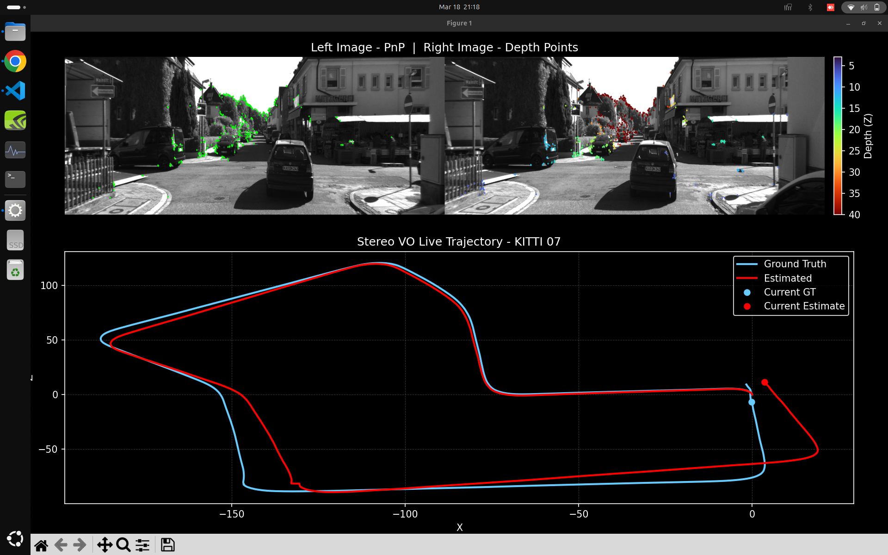

# Stereo Visual Odometry

  

## Overview
This project implements a Stereo Visual Odometry (VO) pipeline using classical computer vision techniques. The system estimates camera motion by leveraging stereo image pairs and feature correspondences across time.

The pipeline is modular and designed for clarity, extensibility, and experimentation, making it suitable for both learning and research purposes.

## Features
- Stereo depth estimation using disparity
- ORB feature detection and matching
- Temporal feature tracking across frames
- 3D point reconstruction from stereo pairs
- Camera pose estimation using PnP with RANSAC
- Trajectory visualization (Ground Truth vs Estimated)
- Depth-based visualization on images

## Project Structure
proj2_stereoVO/
│
├── data/                # Dataset loading and calibration
├── features/            # ORB detection and matching
├── stereo/              # Depth and 3D reconstruction
├── vo/                  # Main VO pipeline
├── visualization/       # Plotting and debug utilities
│
├── main.py              # Entry point
├── requirements.txt
└── README.md

## Pipeline Overview
1. Load stereo images  
2. Detect features using ORB  
3. Perform stereo matching (left-right)  
4. Compute 3D points via triangulation  
5. Match features across time  
6. Estimate pose using PnP with RANSAC  
7. Update trajectory  

## Visualization
- Feature inliers projected on images  
- Depth-colored keypoints (near to far)  
- Trajectory comparison:
  - Ground Truth shown in light blue  
  - Estimated trajectory shown in red  

## Key Concepts
- Epipolar geometry  
- Stereo triangulation  
- Perspective-n-Point (PnP)  
- RANSAC for outlier rejection  
- Feature-based motion estimation  

## How to Run
git clone https://github.com/varunpshrivathsa/Stereo-Visual-Odometery.git  
cd Stereo-Visual-Odometery  

pip install -r requirements.txt  
python main.py  

## Dataset
The project uses stereo image sequences along with calibration data. Ensure the dataset is placed correctly inside the data/ directory and follows the expected structure.

## Results
The system produces accurate short-term motion estimates. As expected in pure visual odometry, drift accumulates over longer sequences. Performance depends on feature quality, matching robustness, and scene texture.

## Future Improvements
- Bundle adjustment for global optimization  
- Loop closure detection  
- Integration with SLAM frameworks  
- GPU acceleration for real-time performance  
- Deep feature matching using SuperPoint or SuperGlue  

## Contributions
Contributions are welcome. You can fork the repository, make improvements, and submit pull requests.

## License
This project is open-source and available under the MIT License.